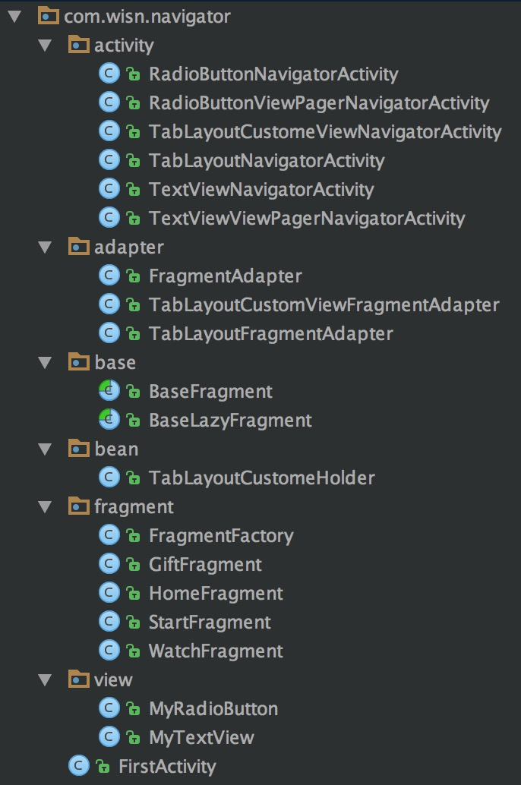

# NavigatorBar


All Navigator for Andorid

##  example

```java
RadioButtonNavigatorActivity
RadioButtonViewPagerNavigatorActivity
TabLayoutCustomeViewNavigatorActivity
TabLayoutNavigatorActivity
TextViewNavigatorActivity
TextViewViewPagerNavigatorActivity
```


### ScreenShot




## Example TabLayout

```js

public class TabLayoutCustomeViewNavigatorActivity extends AppCompatActivity implements TabLayout.OnTabSelectedListener {
	.....
    @Override
    protected void onCreate(Bundle savedInstanceState) {
        super.onCreate(savedInstanceState);
        setContentView(R.layout.activity_navigator_tab_layout);
        mViewPager = (ViewPager) findViewById(R.id.viewpager);
        mTablelayout = (TabLayout) findViewById(R.id.tablelayout);
    }

    @Override
    protected void onStart() {
        super.onStart();
        TabLayoutCustomViewFragmentAdapter
                fragmentPagerAdapter =
                new TabLayoutCustomViewFragmentAdapter(getSupportFragmentManager(), data, images, data);
        mViewPager.setAdapter(fragmentPagerAdapter);
        mViewPager.setCurrentItem(0);
        mTablelayout.setupWithViewPager(mViewPager);
        mTablelayout.setTabMode(TabLayout.MODE_FIXED);
        for(int i=0;i<mTablelayout.getTabCount();i++){
            mTablelayout.getTabAt(i).setCustomView(fragmentPagerAdapter.getView(this,i));
        }
        mTablelayout.addOnTabSelectedListener(this);
    }


    @Override
    public void onTabSelected(TabLayout.Tab tab) {
        updateTab(tab,images2,R.color.selectColor);
    }

    @Override
    public void onTabUnselected(TabLayout.Tab tab) {
        updateTab(tab,images,R.color.unSelectColor);
    }

    public void updateTab(TabLayout.Tab tab,int[] images,int textColorId){
        View inflate = tab.getCustomView();
        int  position = tab.getPosition();
        TabLayoutCustomeHolder tabLayoutCustomeHolder = (TabLayoutCustomeHolder) inflate.getTag();
        if(tabLayoutCustomeHolder!=null){
            tabLayoutCustomeHolder.mImageView.setImageResource(images[position]);
            tabLayoutCustomeHolder.mTextview.setText(data.get(position));
            tabLayoutCustomeHolder.mTextview.setTextColor(ContextCompat.getColor(this,textColorId));
        }else{
            ImageView imageView= (ImageView) inflate.findViewById(R.id.imageView);
            TextView textview= (TextView) inflate.findViewById(R.id.textView);
            imageView.setImageResource(images[position]);
            textview.setText(data.get(position));
            textview.setTextColor(ContextCompat.getColor(this,textColorId));
        }
    }
    @Override
    public void onTabReselected(TabLayout.Tab tab) {

    }
}
```

## example BaseLazyFragment

```java
public abstract class BaseLazyFragment extends Fragment {
    public  String TAG = getFragment();

    private View rootView;
    private boolean isFirstVisible=true;
    @Nullable
    @Override
    public View onCreateView(LayoutInflater inflater,
                             @Nullable ViewGroup container,
                             Bundle savedInstanceState) {
        if(rootView==null){
            rootView=onCreateLazyView(inflater,container,savedInstanceState);
        }
        return rootView;
    }

    @Override
    public void onViewCreated(View view, @Nullable Bundle savedInstanceState) {
        super.onViewCreated(view, savedInstanceState);
        boolean isFrameVisible= getUserVisibleHint();
        if (isFirstVisible&&isFrameVisible) {
            firstVisible();
        }
    }

    @Override
    public void setUserVisibleHint(boolean isVisibleToUser) {
        super.setUserVisibleHint(isVisibleToUser);
        boolean isFrameVisible= getUserVisibleHint();
        if (isFirstVisible&&isFrameVisible) {
            firstVisible();
            isFirstVisible = false;
        }
        if(isFrameVisible){
            onFragmentVisibleChange(true);
        }
    }

    @Override
    public void onDestroyView() {
        super.onDestroyView();
        if (rootView != null) {
            ((ViewGroup) rootView.getParent()).removeView(rootView);
        }
    }

    @Override
    public void onDestroy() {
        super.onDestroy();
        rootView=null;
        isFirstVisible=false;
    }

    public void onFragmentVisibleChange(boolean isVisible){}

    public void firstVisible() {}

    public abstract View onCreateLazyView(LayoutInflater inflater,
                                          @Nullable ViewGroup container,
                                          @Nullable Bundle savedInstanceState);
    public abstract String getFragment();
}
```
......

## License

The MIT License
